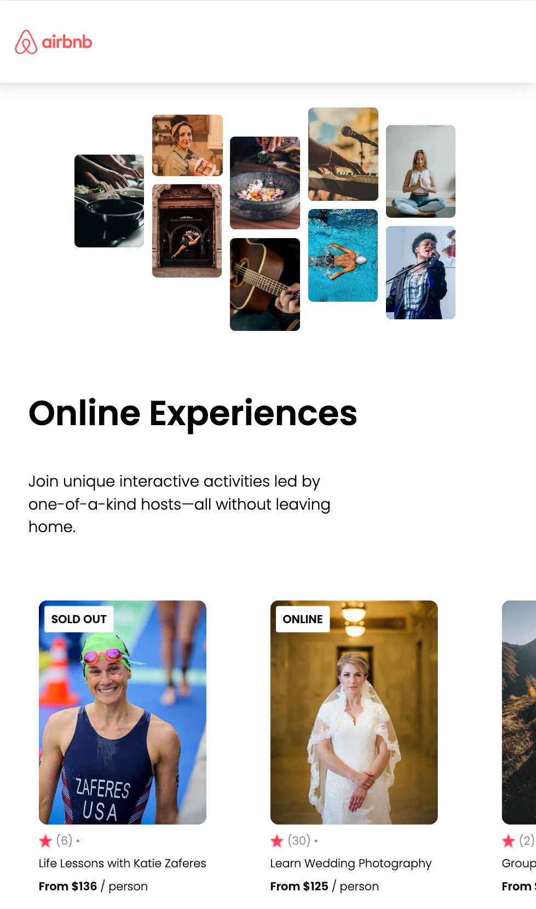

# React Airbnb Clone

React Airbnb Clone is a React project that simulates the Airbnb experience browsing. It's built using modern React features and provides an interactive way to view different accommodations and experiences.


<div align="center">
  
</div>


## Technology Used

- **React**: The project is built using React 18.2.0, utilizing functional components and JSX.
- **React-DOM**: Used for rendering the components into the DOM.
- **CSS**: Styling is applied using a separate CSS file to ensure a clean and attractive design.

## Project Structure

### `App.js`

The main component of the application that imports the `Navbar`, `Hero`, and `Card` components. It maps through the data and renders each card item.

### `Card.js`

This component represents an individual card item, such as an accommodation or experience. It receives the item data as props and renders the details, including the image, rating, title, and price. It also uses conditional rendering to display badges like "SOLD OUT" or "ONLINE" based on the item's properties.

### `Hero.js`

A hero section that displays a large image and introductory text about online experiences.

### `Navbar.js`

A simple navigation bar component that displays the Airbnb logo.

### `index.js`

The entry point of the application, where the `App` component is rendered into the root element.

### `styles.css`

Contains all the styling rules for the application, ensuring a consistent and appealing visual design.

## Installation and Running

To install the dependencies, run:

```bash
npm install
```

To start the development server, run:

```bash
npm start
```

## View on CodeSandbox

Or you can view this project on CodeSandbox [here](https://codesandbox.io/p/github/LurieK/React-AirbnbClone).


## License

This project is open-source and available under the MIT License.

